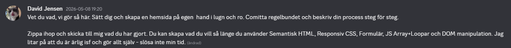

 ### https://github.com/galenginger/MiddagsSpinnare ###
 
 # Middagsspinnaren

  En webbsida där du lägger till egna måltider och snurrar ett hjul
  för att slumpmässigt välja kvällens middag.

  ## Syfte

  Projektet är byggt istället för en tenta, då en tenta visar inte ett smack.
  Jag kommer även att vidareutveckla denna när mer kunskaper/tid finns för att använda den i real på en liten skärm i köket.

  - Semantisk HTML
  - Responsiv CSS (mobile-first)
  - Formulär
  - JavaScript - Arrayer och loopar
  - DOM-manipulation

  ## Tekniker

  - HTML
  - CSS (Flexbox, CSS-variabler, conic-gradient, @keyframes)
  - JavaScript

  ## Funktioner

  - Lägg till egna måltider via formuläret
  - Ta bort måltider med X-knappen
  - Hjulet uppdateras automatiskt när listan ändras
  - Snurra hjulet i 5-6 sekunder med bromsande animation
  - "Vinnande" måltid visas med en pop-in animation när hjulet stannar

  ## Hur man kör projektet

  Öppna index.html direkt i valfri webbläsare. Ingen server behövs.

  ## Filstruktur

  MiddagsSpinnare/
    index.html - HTML-struktur
    style.css - All CSS och animationer
    script.js - All JavaScript-logik

  ## Kod

  - All kod skriven på engelska (variabelnamn, funktioner, attribut)
  - Kommentarer skrivna på svenska
  - CSS följer mobile-first: baststilar for mobil,
    @media (min-width: 600px) for desktop

  ## Genomförande - steg för steg

  Projektet byggdes i 6 separata steg med ett commit per steg.
  (Kunde varit fler steg, men insåg att detta var lättare än jag trott, och blev svårt att bryta isär mer än såhär.)

  ### Steg 1 - Semantisk HTML
  Skapade grundstrukturen i index.html med semantiska taggar:
  header, main, section och footer. Semantisk HTML beskriver
  vad innehållet är, inte hur det ser ut.

  ### Steg 2 - Responsiv CSS
  Skapade style.css med CSS-variabler for färger och storlekar,
  Flexbox-layout och en media query for desktop. Mobile-first
  innebär att basstilarna gäller for mobil och desktop-anpassningar
  läggs på med min-width.

  ### Steg 3 - Formulär, Array och Loop
  Skapade script.js med en array som håller måltiderna, en
  for-loop som renderar listan i DOM:en och en formulär-lyssnare
  som validerar och lägger till nya måltider. DOMContentLoaded
  säkerställer att scriptet körs först när HTML-strukturen är
  inläst, trots att script-taggen ligger i head.

  ### Steg 4 - Rita hjulet med DOM-manipulation
  Lade till drawWheel() som bygger en conic-gradient-sträng
  via en loop och sätter den direkt på elementets style-egenskap.
  En färgkodad legend byggs på samma sätt och uppdateras
  automatiskt när listan ändras.

  ### Steg 5 - Snurranimation
  Lade till spin() med tidbaserad animation via
  requestAnimationFrame och timestamp. Ease-out-formeln
  1 - (1-t)^3 ger en snabb start som kryper in i slutet.
  Vid 50% av tiden är redan 87.5% av rotationen klar.
  Animationen tar 5-6 sekunder oavsett skärmens
  uppdateringsfrekvens.(Fick ta lite hjälp utav AI/Google för att få till det perfekt)

  ### Steg 6 - Visa vinnare och ta bort måltider
  Lade till showWinner() som normaliserar hjulets vinkel och
  räknar ut vilket segment pilen pekar på med modulo-matematik.
  Vinnaren visas med en CSS @keyframes pop-in animation.
  En ta bort-knapp per rad använder splice() for att ta bort
  ur arrayen och ritar om hjulet direkt.

  ## Krav uppfyllda - Krav    <--- Click me yo!

  - Semantisk HTML - index.html med header, main, section och footer
  - Responsiv CSS - style.css med Flexbox och @media min-width 600px
  - Formulär - meal-form i script.js med validering av tom input
  - Arrayer och loopar - meals-array med for-loopar i showList() och drawWheel()
  - DOM-manipulation - createElement, style, classList och innerHTML i script.js

 ### https://github.com/galenginger/MiddagsSpinnare ###